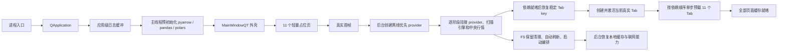
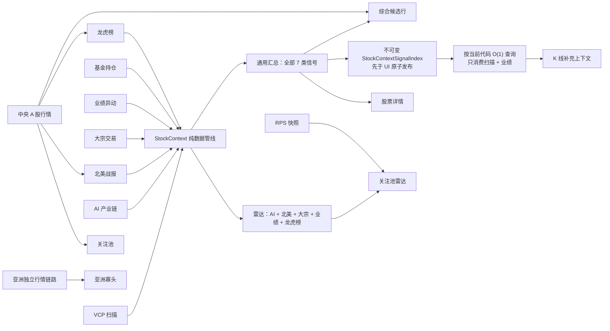
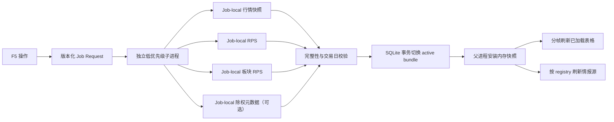
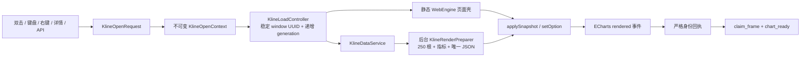

# 功能、Tab 与逻辑关系说明

最后校验：2026-07-19

本文档回答三个问题：软件有哪些功能；11 个 Tab 各自负责什么；数据和操作如何在 Tab 之间流动。注册顺序、刷新策略和运行时策略以 `ui/workspaces/tab_registry.py` 为唯一代码真相源。

## 1. 软件功能总览

紫金研选是一套 Windows 优先、离线优先的 PyQt6 投研终端。它把本地通达信行情、VCP/RPS、实时行情和多个情报源汇总到同一个股票上下文中。

全局能力分为六组：

| 能力 | 用户入口 | 核心作用 | 主要下游 |
| --- | --- | --- | --- |
| 页面导航 | 标题栏分组导航、`Ctrl+K` 命令面板 | 按稳定 Tab key 打开页面；保存 key，同时保留旧 index 回退 | 11 个主 Tab |
| 全局同步 | 标题栏同步按钮、`F5` | 在独立进程构建行情、RPS、板块 RPS 和可用的除权元数据快照；父进程校验后原子激活 | 行情仓库、关注池、各数据 Tab、中央报价 |
| 实时行情 | 启动后的中央行情服务 | 汇总代码、批量报价、补股本/市值、合并全局快照 | 关注池、龙虎榜、北美战报、综合候选 |
| 股票上下文 | 右键菜单、股票全景、综合候选、K 线 | 把扫描、产业链、战报、资金和业绩信号按股票代码合并 | 关注池雷达、综合候选、股票详情、K 线摘要 |
| K 线复盘 | 表格双击、右键菜单、命令面板 | 保留当前列表、来源 Tab、当前行和补充上下文，支持前后切换 | K 线窗口、关注状态、外部终端 |
| 运行与诊断 | 系统日志、运行时健康、状态栏 | 记录启动前后日志、任务、线程、Timer、WebEngine、数据血缘和性能预算 | 故障定位、长稳验证、项目审计 |

此外，标题栏系统菜单提供主题、表格密度、开机自启动和运行时健康入口；交易日历会叠加全球核心公司财报日期。

## 2. 启动与退出逻辑

启动约束：

- 11 个 Tab 启动时先挂轻量页面壳，首屏隔离真实业务 QWidget 的构造成本；这只是实现细节，产品语义是首开后台全量预载，不是等待用户点击的数据按需加载。
- `pyarrow`、`pandas`、`polars` 等含原生扩展的数据运行时在启动页显示后由主线程按固定顺序幂等初始化；线程池不得承担首次原生模块装载。
- 首屏、provider、扫描引擎和当前真实页面就绪后，后台协调器按依赖顺序逐个创建真实 QWidget，并通过统一 capability 等待该页本地数据完成后再继续。
- 后台预载不主动切换当前索引；用户点击尚未轮到的页面时，占位页可以立即成为当前页，正在执行的步骤不被并发打断，目标 Tab 被移动到该步骤之后的下一个串行槽。真实 widget 构造、本地读取和 prime 仍由同一协调步骤各执行一次，不另开点击加载路径。
- 首开队列只读本地缓存、数据库、文件和已有内存快照；联网补缺、全量同步、全市场扫描等重操作仍由用户操作、F5 或既有调度器负责。
- 首帧完成后按阶段初始化 provider、扫描引擎和启动编排器，依赖就绪后再恢复上次页面。稳定 key 优先，旧 index 仅用于兼容已有设置。
- 首帧后立即点击 Tab、F5 或网络菜单也不会捕获空依赖：请求会保留到运行时就绪，或明确反馈初始化状态。
- 日志缓冲在 `QApplication` 创建后立即安装，因此系统日志页尚未打开时产生的日志可在 3000 条有界容量范围内回放；超限时淘汰最旧记录。
- 日志缓冲之后安装 `infra.diagnostics.ui_exception_boundary`。从 Qt signal/slot 回调逃逸的 Python 异常会写入 stderr 和 `data/crash_report.log`，hook 正常返回，避免 PyQt 将回调异常升级为 Qt `qFatal`；原生崩溃仍由 `faulthandler` 记录，二者职责不同。
- 隐藏的状态动画、脉冲和时钟不运行；显示时启动，隐藏、关闭或删除时停止并断开订阅。

### 首开后台加载序列

这条链路统一称为“首开分阶段后台全量预载”（staged eager preload）。用户完全不点击 Tab，11 页也会自动进入 ready。

| 顺序 | Tab | 预载内容 | 排序原因 |
| --- | --- | --- | --- |
| 1 | 关注池 | 本地自选行、内存行情快照、本地 VCP/RPS 附加指标 | 首屏核心消费端，先建立基础代码集合 |
| 2 | 系统日志 | 回放应用级有界日志缓冲 | 极轻量，并让后续每一步都有可观察日志 |
| 3 | AI产业链 | 本地产业链数据、股票池、5/10/20 日派生涨幅 | 上游行业/股票上下文，先于资金和业绩源稳定 |
| 4 | 北美战报 | 本地战报文件合并与 A 股映射 | 独立上游信号源，不发实时行情请求 |
| 5 | VCP扫描 | 已保存扫描缓存、排序和去重 | 独立上游形态信号，不在首开执行全市场扫描 |
| 6 | 大宗交易 | 本地原子缓存 | 在 AI 上下文之后装配；不执行 30 日联网抓取 |
| 7 | 业绩异动 | 本地 SQLite/cache 记录 | 在上游股票池稳定后装配；不启动联网巡逻 |
| 8 | 基金持仓 | 本地 SQLite 持仓快照 | 只读已有快照，不执行全量同步 |
| 9 | 龙虎榜 | 本地滚动池与已有缓存 | 只读本地池；缺口、远程回补和报价留到激活后 |
| 10 | 亚洲寡头 | 本地亚洲行情 JSON | 使用独立行情链路，放在 A 股信号源之后降低首开竞争 |
| 11 | 综合候选 | 最新不可变 `StockContextSnapshot` 的多源聚合，以及同批生成的 `StockContextSignalIndex` | 最终消费前述业务信号，必须最后构建并原子发布 K 线单代码查询索引 |

后台协调器始终只有一个活动步骤。单页成功、空结果或可控失败都必须进入明确终态；普通失败会记录后继续队列。步骤超时后先请求协作取消并进入 cancellation-blocked 状态，旧任务仍占用 worker slot 或取消回执尚未物理结算时不得启动下一页；只有回执已 `accepted` 且 `settled` 后才自动恢复队列，从而保证实际并发始终为 1。运行健康预算会把失败、超时或取消结算异常判为失败。若被用户提权的真实 widget 已经构造且仍是当前页，即使本地预载失败或超时，也只执行一次“非交互 → 交互”提升和一次激活通知；若构造本身失败，则占位页保留错误且没有伪造可提升的 widget。

`AutoRefreshScheduler` 可以随 post-paint 初始化，但协调器尚未完全 settled 时不提交任何计划任务；首次 settled 后按 monotonic clock 留出固定 60 秒稳定窗口。首个放行 tick 使用 settled 时捕获的业务时刻判断到期任务，避免宽限跨日期时遗漏已到期作业。

AI 产业链的 5/10/20 日派生涨幅优先请求 `max(period)+1` 个有效收盘尾值。读取顺序为内存缓存、Parquet/SQLite 窄投影、单票本地回退；窄接口不可用或失败时才回退既有 `get_data_batch()` 路径，正常路径不物化整段历史 frame，计算口径保持不变。

网络证据使用两套不同语义：

- `network_capable` 是 registry 声明的能力边界，只回答该页面是否存在合法远端业务，不代表本次已经联网。
- `triggered_network` 是 widget 实例级单向闩锁，初始为 `false`；实际提交远端请求或远端 worker 时才变为 `true`，同一实例内不回退。
- 隐藏预载预算只接受唯一一条 `after_background_preload` 样本。其覆盖分区必须精确为 10 个数据 Tab：`watchlist`、`ai_industry_chain`、`na_daily`、`scan`、`foreign_block`、`earnings`、`fund_holdings`、`lhb`、`asian_market`、`stock_candidates`；`system_log` 必须且只能作为 `non_data_tab` 排除。
- 覆盖缺失、额外项、重复项、覆盖/排除交集、数据行不一一对应、页面未 loaded、`network_capable`/`triggered_network` 缺失或不是严格 bool、`lineage_error=true`，以及任一 `triggered_network=true` 都会 fail-closed。
- `StockContextWidgetSnapshotAdapter` 只通过公开 `DataLineageCapability.get_data_lineage()` 和工作区公开状态捕获普通数据，不读取页面私有加载标志；关注池等 UI 命令由 `WorkspaceFacade` 编排，纯查询服务只消费不可变快照。

退出约束：

- 先设置 closing/cancel 标记，再依次停止 F5、K 线、窗口任务、日历、启动编排、自动刷新和行情服务，然后广播关闭并关停工作区。
- 各组件在自己的 `shutdown()` 中保存关注池和表格列状态；工作区停止后再保存主窗口 geometry，并重置全局行情快照。
- 关闭采用有界等待；超时任务不能在窗口销毁后继续回写 UI 或发布新快照。
- 工作区 shutdown receipt 必须证明 preload Timer inactive、active/cancelling key 为空、`active_step_count=0`、剩余及提权队列为空、`cancellation_blocked=false`，并且全部 `shutdown_cancel_receipts` 已 accepted、local settled 和 settled。

## 3. 11 个 Tab 的顺序与职责

内部堆栈顺序保持兼容：`watchlist → lhb → asian_market → na_daily → stock_candidates → ai_industry_chain → scan → foreign_block → earnings → fund_holdings → system_log`。

标题栏按分组和 `group_order` 展示：

- 主工作台：关注池 → 龙虎榜 → 亚洲寡头 → 北美战报 → 综合候选
- 情报源：VCP扫描 → AI产业链 → 大宗交易 → 业绩异动 → 基金持仓
- 系统：系统日志

| key / 页面 | 直接输入 | 页面功能与产出 | 被谁使用 |
| --- | --- | --- | --- |
| `watchlist` 关注池 | 自选池、全局行情、RPS，以及北美战报、AI 产业链、大宗、业绩、龙虎榜信号 | 增删、搜索、拖拽、排序；展示行情、RPS、细分板块和多源摘要；保存来源标签与最终顺序 | K 线、股票详情；它是消费端，不负责替代各情报源原始数据 |
| `lhb` 龙虎榜 | AkShare 东方财富龙虎榜、30 日滚动本地池、机构/外资席位规则 | 展示上榜次数、最近上榜、净买、机构净买、外资净买与原因 | StockContext、综合候选、关注池雷达、股票详情 |
| `asian_market` 亚洲寡头 | 台/日/韩/港历史和盘中行情、本地亚洲缓存、估值数据 | 多市场核心资产跟踪、市场状态、角色定位、阶段涨跌和 K 线 | 独立多市场观察；使用自己的行情链路，不加入 A 股中央报价集合 |
| `na_daily` 北美战报 | 兄弟项目“每日战报”的本地产物 | 提取 A 股映射、催化剂、细分板块、评级和风控，并叠加 A 股实时行情 | StockContext、综合候选、关注池雷达、股票详情和来源感知 K 线 |
| `stock_candidates` 综合候选 | VCP 扫描、AI 产业链、北美战报、大宗、业绩、基金持仓、龙虎榜的 `StockSignal` | 按代码聚合共振分、来源数、首要信号、板块和摘要；不抓取新的外部数据 | 最终候选观察、股票详情、K 线 |
| `ai_industry_chain` AI产业链 | 本地产业链工作簿、股票池、上下文映射和本地行情 | 展示产业链环节、标的和备注，输出产业链/板块信号 | StockContext、综合候选、关注池雷达、股票详情 |
| `scan` VCP扫描 | 本地全市场日线、RPS、VCP 规则、扫描缓存 | 全量/增量扫描；输出评分、RPS、距突破、状态、结构和触发日期 | StockContext、综合候选、股票详情、K 线 VCP 摘要 |
| `foreign_block` 大宗交易 | AkShare 大宗交易子进程、本地原子缓存、外资席位过滤 | 按日期、席位、动作和交易窗口筛选；输出交易方向、席位和金额 | StockContext、综合候选、关注池雷达、股票详情 |
| `earnings` 业绩异动 | 预告、快报、财报和本地 SQLite 状态 | 去重并展示报告期、类型、同比/环比、利润和公告日期 | StockContext、综合候选、关注池雷达、股票详情、K 线业绩摘要 |
| `fund_holdings` 基金持仓 | 东方财富基金/QFII 数据、本地 SQLite 快照 | 同步并比较主体、资金属性、季度、变化类型、占比和持股变化 | StockContext、综合候选、股票详情 |
| `system_log` 系统日志 | 应用级有界日志缓冲、系统日志事件 | 回放打开前日志、实时追加、按代次安全清空；不接入数据血缘或行情 | 运行排障与任务观察 |

## 4. Tab 之间的数据关系

StockContext 的边界规则：

1. GUI 线程只负责从已加载 Tab 的公开 capability 复制普通数据。
2. 后台任务只接收独立快照、代码集合和纯配置，不持有 QWidget、QAbstractItemModel 或绑定方法。
3. StockContext 查询本身不会偷偷构造 Tab；真实页面只允许由首开预载协调器或明确的用户导航创建。
4. `domains/stock_context/` 只做行到信号的纯转换；`app/services/stock_context_*` 负责查询、缓存和应用边界；UI 只捕获与回写。
5. 结果回到 GUI 线程后才更新表格模型，并用签名跳过无变化的全表刷新。
6. 综合候选和通用股票详情消费 7 类信号；关注池雷达不消费基金持仓和 VCP 原始信号；K 线的 StockContext 补充只消费扫描与业绩信号。
7. 所有生产聚合入口统一查询不可变快照，不保留 legacy builder 双路径；股票详情只查询当前代码，并显式声明上述 7 类信号。
8. 综合候选 worker 从同一快照同时产出候选行和不可变 `StockContextSignalIndex`；成功回调先原子发布索引、再提交候选表格，避免 K 线读到“新表格 + 旧上下文”的混合代次。
9. 工作区一旦提供生产发布索引能力，K 线只查询当前代码；索引尚未发布、读取异常或代码无信号时均返回空补充，不回退到整工作区快照或 Widget 遍历。
10. StockContext 默认仍携带 RPS，保证综合候选等消费者不变；关注池 VCP/雷达任务显式使用 `include_rps_bundle=False`，GUI 线程只复制来源行，worker 再在 F5 snapshot read boundary 内原子读取当前 active RPS。非 object、损坏或不可读 RPS 按无 RPS 降级，不让整次关注池刷新失败。

## 5. TabRegistry 策略矩阵

Tab 的视觉分组不再决定业务行为。构造默认值、后台/探针模式默认值和首开延迟参数名也由不可变 `TabDefinition` 声明，`ClassicWorkspace` 只按通用 runtime policy 解释，不再对 11 个 key 分别编码。下列业务策略同样由 registry 显式声明：

| Tab | 加载后的 A 股中央报价贡献 | 参与工作区 SnapshotRefresh 调度 | F5 后刷新自身数据源 | 首开后台预载 |
| --- | --- | --- | --- | --- |
| 关注池 | 是 | 是 | 否 | 是，本地行/内存快照 |
| 龙虎榜 | 是 | 独立处理 | 否 | 是，本地池且不回补 |
| 亚洲寡头 | 否，使用亚洲链路 | 是 | 否 | 是，本地 JSON |
| 北美战报 | 是 | 是 | 否 | 是，本地战报 |
| 综合候选 | 是 | 独立处理 | 否 | 是，派生聚合且最后执行 |
| AI产业链 | 否 | 独立处理 | 是 | 是，本地数据与派生涨幅 |
| VCP扫描 | 否 | 独立处理 | 是 | 是，已有扫描缓存 |
| 大宗交易 | 否 | 独立处理 | 是 | 是，本地原子缓存 |
| 业绩异动 | 否 | 独立处理 | 是 | 是，本地缓存记录 |
| 基金持仓 | 否 | 独立处理 | 是 | 是，本地数据库 |
| 系统日志 | 否 | 否 | 否 | 是，内存缓冲 |

这样移动 Tab 分组或调整标题栏顺序不会意外改变行情订阅、F5、后台预载或数据血缘行为。中央 A 股报价集合只汇总已加载页面的公开能力，报价轮询本身绝不会为了枚举代码构造 QWidget；页面由首开协调器加载后即加入集合，切走后仍持续贡献。亚洲寡头使用独立行情链路，不会因 F5 重建亚洲原始缓存。完成后台预载的隐藏页面会参与后续 F5 刷新，但 F5 不负责创建尚未装配的占位页。

## 6. F5 的完整逻辑

关键语义：

- 子进程只写自己的 generation，不覆盖当前可用缓存。
- 父进程持续接收 `prepare → gbbq → market_sync → market_stage → rps → sector_rps → validate` 阶段事件；生产回执必须同时记录父/worker PID、run_id、snapshot_id、各阶段、终态和 post-F5 收尾。
- Qt 侧 `F5JobController` 不直接执行阻塞 handle 操作；专属 `f5-worker-monitor` 独占事件轮询、deadline、协作取消、宽限期终止/强杀和 reap，Qt Timer 只从线程安全消息队列消费有序事件与终态。
- `requested_date` 是发起同步的请求日期；`effective_trade_date` 是行情 Parquet 的实际最大交易日，周末或节假日二者可以不同。
- 行情、RPS120、RPS250 和板块 RPS 必须与同一个 `effective_trade_date` 一致，并通过路径、schema、来源、行数、股票数和有效值数量校验。
- 父进程只激活完整 bundle；失败、取消或超时继续沿用旧 active bundle。
- 任务用 `status + error_code` 区分成功、取消、超时、启动失败、计算失败和激活失败；失败状态统一为 `FAILED`，具体阶段由 `error_code` 表达。
- 超时或窗口退出时先协作取消，超过宽限期再终止/强杀并回收进程；当前没有运行中任务的用户取消入口。
- Windows worker 以 below-normal priority 启动，并只向 F5 子进程注入 `POLARS_MAX_THREADS=max(1,min(4,logical_cpu_count//2))`，同时把 `OPENBLAS_NUM_THREADS`、`OMP_NUM_THREADS`、`MKL_NUM_THREADS`、`NUMEXPR_NUM_THREADS` 固定为 1；小 CPU 环境下下限为 1，不修改父进程全局 Polars/BLAS 配置。
- 生产读取统一解析 active bundle；旧文件镜像只用于兼容，不是真相源。
- generations/jobs 采用有界保留：保护 active、previous 和尚未被父进程消费的 `ready_to_activate` 任务；失败 generation 删除，旧终态 job 在下一次 retention 立即清理，只允许当前终态 job 短暂存在。真实 F5 退出时，active snapshot 与唯一 terminal job 必须都等于最后成功 run_id。
- 失败、取消、激活异常及 owner shutdown 都先持久化 terminal result，再启动 controller-owned terminal cleanup；controller 在清理线程结束前保持 running，shutdown 必须在同一截止时间内等待 monitor、activation 和 cleanup 三者结算。退出磁盘回执对孤儿/不完整 generation、unfinished/ready/invalid job、临时文件和完整性不匹配全部 fail-closed。

## 7. K 线完整功能与生命周期

### 功能矩阵

| 功能域 | 当前生产能力 |
| --- | --- |
| 打开入口 | 表格双击、键盘、统一右键菜单、股票详情按钮和程序接口 |
| 窗口 | 独立无边框窗口，最多 5 个；同一股票允许重复打开，达到上限时按既有规则回收最早窗口 |
| 导航 | 上一只/下一只、Left/Right、与来源主表选中行同步、加入/移出关注池 |
| 数据范围 | 日线固定最后 250 根；A 股本地行情与亚洲市场缓存/实时行情走统一数据服务但保留各自数据源状态 |
| 三面板 | K 线主图、成交量、MACD；十字光标、OHLC/涨跌/量价工具栏、滚轮缩放、拖动平移 |
| 均线与指标 | MA10、MA20、MA50、MA150、MA200、均线收敛淡化、MA200 穿越强调、VOL-MA20、MACD、DIFF、DEA |
| 业务覆盖层 | VCP 箱体、趋势线、突破标记；业绩日期标记及 tooltip；普通量、地量、放量与粒子效果 |
| 上下文 | 各来源 Tab 摘要卡、扫描与业绩 StockContext 补充、实时行情、关注池状态 |
| 外观与窗口交互 | 主题切换、Mica/玻璃、磁吸、F11、标题栏双击全屏、Esc、窗口状态恢复、可靠释放 |
| 明确排除 | 不补回 MA5；不补回历史 B/S/T 账户交易标记；不新增周线、分钟线或周期切换 |

### 数据、渲染与 owner 关系

- 每个物理窗口拥有稳定 UUID；每次打开、复用或切股递增 generation，任务 ID 统一为 `kline:{window_id}:{generation}:{stage}`。DataFrame、Prepared Snapshot、Python 回调和 JS 回执均校验 owner、window_id、code、generation、snapshotVersion 与关闭状态，同股多窗口互不取消或覆盖。
- 打开阶段严格记录 `shell_ready → browser_ready → data_ready → js_ready → chart_ready → first_interaction`。其中 `shell_ready` 表示顶层轻量 Qt 窗口壳可见；冷创建/受控恢复在 `browser_ready` 前进一步拆成 `create → handoff/skip → attach → WebEngine shell` 四个 owner-owned 单次 Timer 切片；`data_ready` 表示当前不可变准备结果已被接受，`js_ready` 表示静态页 API 探测通过，`chart_ready` 表示当前 frame owner 收到真实 ECharts `rendered` 确认，`first_interaction` 表示 Browser 上的首个鼠标、滚轮或键盘交互。
- Browser 子流水线记录 `browser_create_ms`、`page_handoff_ms/page_handoff_slice_ms`、`browser_attach_sync_ms`、`load_shell_schedule_ms/load_shell_queue_ms/load_shell_dispatch_ms`、`max_sync_slice_ms` 与 `pipeline_total_ms`；这些是 `browser_ready` 的内部诊断，不替代六阶段 readiness。租用完整 idle 物理窗口时 `full_window_reused=true`、`page_reused=true`、`hierarchy_unchanged=true`，上述冷路径耗时均显式为 `0.0`，表示步骤被完整窗口复用明确跳过，而不是字段漏采。
- `chart_ready` 不以窗口可见、browser 存在或 `setOption()` 返回为成功，而只在当前快照对应的 ECharts `rendered` 事件被轮询确认后提交 frame owner。
- 完整应用健康门禁对每次真实打开建立独立 `kline_open_to_chart_ready` stall receipt：打开前 reset，`chart_ready` 后再跨两个事件循环 tick 截止；scope、reset 或诊断缺失均失败，不能混入 Tab/F5/退出阶段的 stall，也不能用整体平均值替代单次最大值。
- 页面壳与数据准备并行；DataFrame 清洗、MA/VOL-MA20/MACD、payload 和 JSON 序列化在后台完成，GUI 线程只提交一次完整快照。正常路径不重复生成 JSON，受控回退页只在 JS 提交/确认失败时生成。
- 快速切股、隐藏或最小化期间只保留 latest-only 完整快照；旧 frame 立即只读，旧 generation 回调不能写入新股票。相同快照版本和无变化实时数据跳过重复提交；实时 OHLC 更新通过后台小快照同步重算 MA、VOL-MA20、MACD、DIFF 与 DEA。
- JS 只安装一个 `chart.on('rendered')` 监听器，完整快照使用 `lazyUpdate: false`；滚轮、指针和 resize 由 `requestAnimationFrame` 单帧合并。隐藏/最小化时暂停粒子、实时提交和高频交互，恢复后只重放最新快照。
- 监听 `renderProcessTerminated`：单窗口最多执行一次受控 Browser 重建并重放最新有效快照；替换 Browser 再次异常时关闭该 generation 的 controller，进入终止态，禁止无限重启。

### 完整物理窗口单槽池

- 生产预热路径保留至多 1 个完整物理 `KLineChartWindow`。租约复用保持窗口 UUID、Browser、Page、`chart_host` 层级和 parent 不变，只重置业务状态并递增 generation；不存在把 keeper View/Page 搬入新正式窗口的路径。
- 窗口关闭先停止本窗口 Timer/任务、取消渲染确认、断开行情/主题/崩溃恢复信号，再执行 JS `resetForLease`。2 秒内收到健康 reset 回执才进入 idle 单槽；超时、信号断开失败、渲染进程异常、层级变化或已有 idle 窗口均 fail-closed 销毁物理窗口。
- WebEngine 尚未预检/预热完成时只保留最新 pending-open，请求 ready 后在 GUI 线程自动恢复，同时继续遵守最多 5 个可见窗口限制。
- manager shutdown 必须返回结构化 receipt，逐项证明活动窗口关闭、池窗口销毁、预热资源销毁、return Timer、idle 崩溃监听、preflight、pending-open 和主窗口引用均清理；运行健康门禁还要求 Task、QThreadPool、watchdog、WebEngine 子进程归零。

## 8. 稳定性与性能不变量

- 11 个稳定 key、页面标题、构造 profile、构造/非交互默认值、首开延迟参数、堆栈顺序和分组顺序都有精确契约测试。
- `TabRegistry` 不导入具体 Tab 或 Qt，因此读取策略不会触发重页面依赖。
- 首帧之前不加载真实业务 Tab；首帧之后先加载当前页，再按依赖顺序单步预载全部页面。
- 后台线程不读取 QWidget 或表格模型；GUI 数据先复制再离开主线程。
- F5 重计算不占用 Qt 全局线程池，也不能发布半成品。
- 隐藏动画和定时器停止；关闭时任务、Timer、事件订阅和子进程有界回收。
- 日志清空使用 generation/sequence，清空前已排队的消息不能重新出现。
- 市场日历统一读写项目根目录下的 `data/vcp_hunter.db`。
- 快速审计检查 Ruff、UTF-8、架构边界和复杂度等静态/定向门禁；完整审计追加全量测试；生产窗口预算需要显式启用可视 production 门禁。
- 生产健康探针按用户侧栏导航路径逐一打开 Tab，并分别采样同步首开、Tab 异步尾部、真实 F5 子进程与原子激活、行情、K 线和退出；F5 收据必须包含不同于父进程的 worker PID、完整阶段事件、成功 snapshot_id 与 post-F5 收尾；`shell_nav` 属于真实交互首开，页面显示后必须启动业务 runtime，重型工作由 registry 的延迟策略错峰执行；任一任务超时或异步尾部卡顿都必须进入预算失败。
- 亚洲页在首开队列中只读取本地 JSON/内存缓存；启动期 `asian_data_sync_bg` 只有在亚洲页当前可见时才允许提交，隐藏页直接跳过。生产预载证据会同时检查 Tab 数据血缘和全局启动 task IDs，避免全局远程任务绕过页面闩锁。
- `soak30/long` 与 `soak60` 的固定最低可见时长为 1800/3600 秒，采样间隔最多 60 秒；命令行缩短、样本缺失、乱序或断档都不能通过预算。
- runtime health 的默认 Tab 集由 `health_probe_tab_keys()` 从 registry 生成并覆盖全部 11 个稳定 key。指定 `--output` 时同步生成 `.checkpoint.json` 与 `.faulthandler.log`：checkpoint 在启动样本、每个周期样本和可见性失败时原子刷新，持续记录最后确认的可见时长、当前阶段/Tab、最后完成边界和样本路径；未处理 Qt 回调异常进入 fail-closed 预算，native abort 即使来不及生成聚合报告也保留最后有效证据。
- K 线精确门禁至少 10 轮，预算为轻量壳 P95 ≤ 120ms、预热后 `browser_ready` P95 ≤ 500ms、本地 A 股 `chart_ready` P50/P95 ≤ 800/1500ms、缓存切股 P95 ≤ 300ms、单次打开最大 GUI stall ≤ 100ms 且 critical stall = 0；cold-first-open、常规预热轮和正式轮次均独立校验 stall/critical。10 轮后活动 Chart View、Task、Timer、Receiver、WebEngine 子进程净增长为 0，RSS 净增长 ≤ 24MB。

## 9. 维护规则

- 新增或修改 Tab 时先改 `ui/workspaces/tab_registry.py`，再实现页面；不要在多个服务重复维护 key 列表。
- 新跨 Tab 信号先在 `domains/stock_context/` 定义纯转换，再通过 app 服务暴露。
- 新后台任务先捕获普通数据；worker 参数中不得出现 QWidget、model 或绑定 UI 方法。
- 新 F5 产物必须加入同一 bundle 的校验与保留策略，不能单独覆盖兼容文件。
- 快速检查运行 `scripts/project_audit.py --quick --keep-going`；完整回归运行 `scripts/project_audit.py --keep-going`；涉及真实启动、Tab 首开、K 线或长稳时运行 `scripts/project_audit.py --quick --keep-going --runtime-health-production`。
